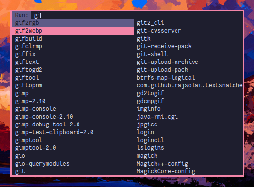

# Dmenu-Flexipatch 
---

Dmenu with my additions using flexipatch

## Screenshot



* morecolors
* XYZ patch
* border
* alpha
* mousesupport
* centering 

# Installing

Just do:

```
    git clone https://gitlab.com/tanbinislam34/dmenu.git
    cd dmenu && sudo make install
```

Refer to [https://tools.suckless.org/dmenu/](https://tools.suckless.org/dmenu/) for details on
dmenu, how to install it and how it works.


